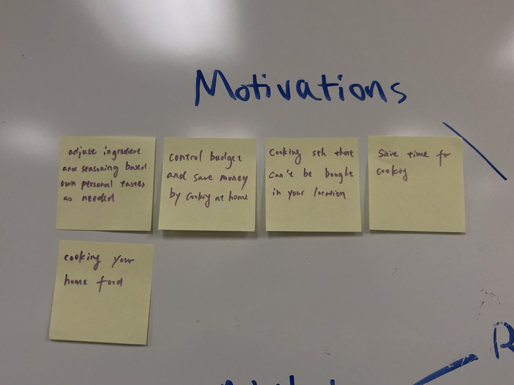
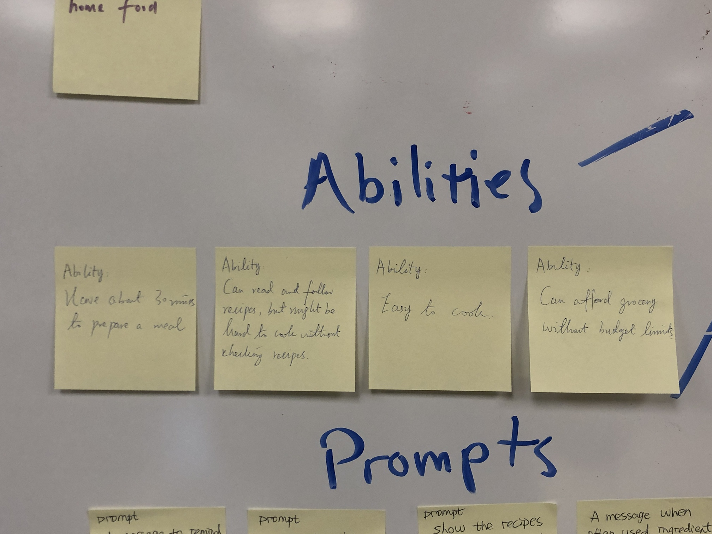
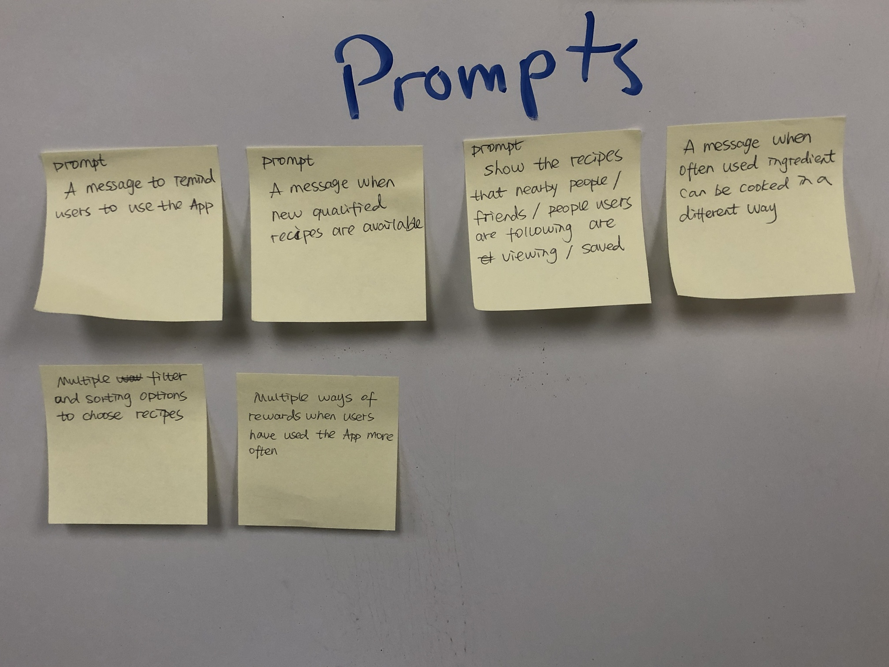
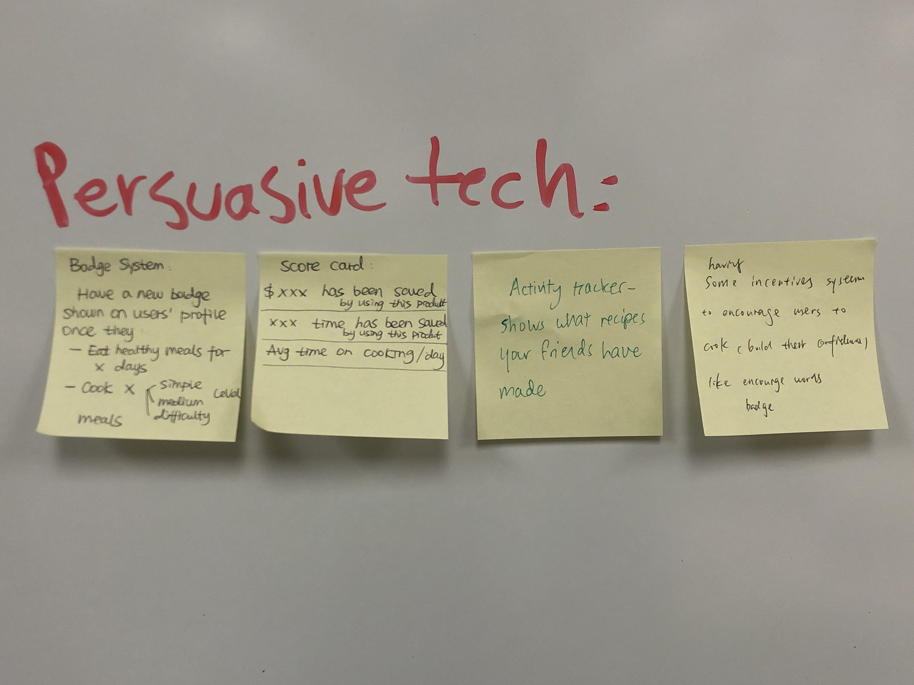
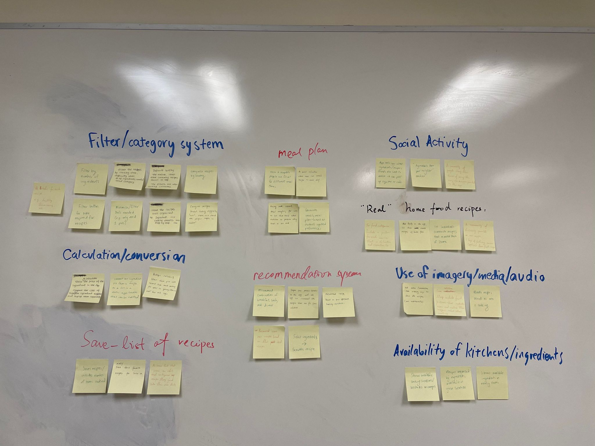
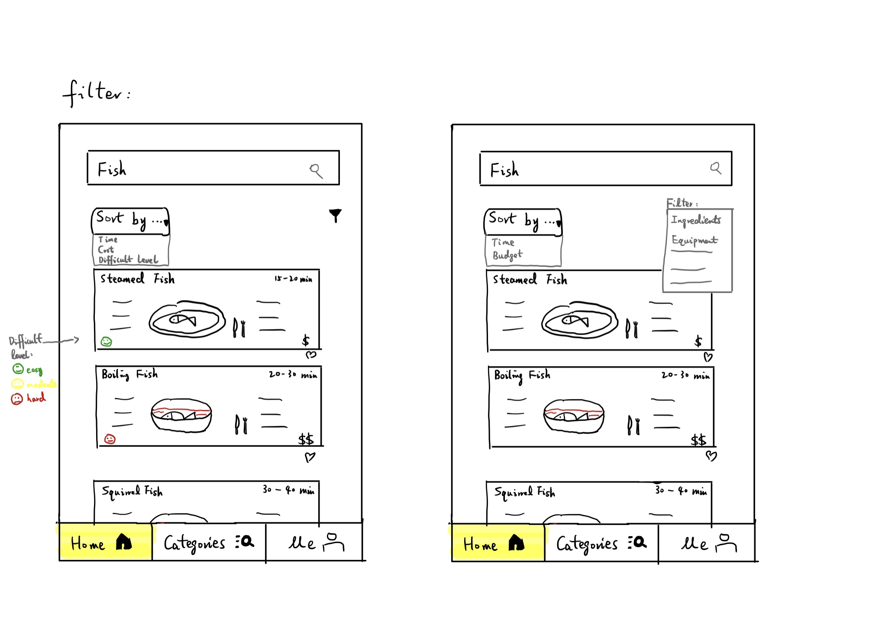
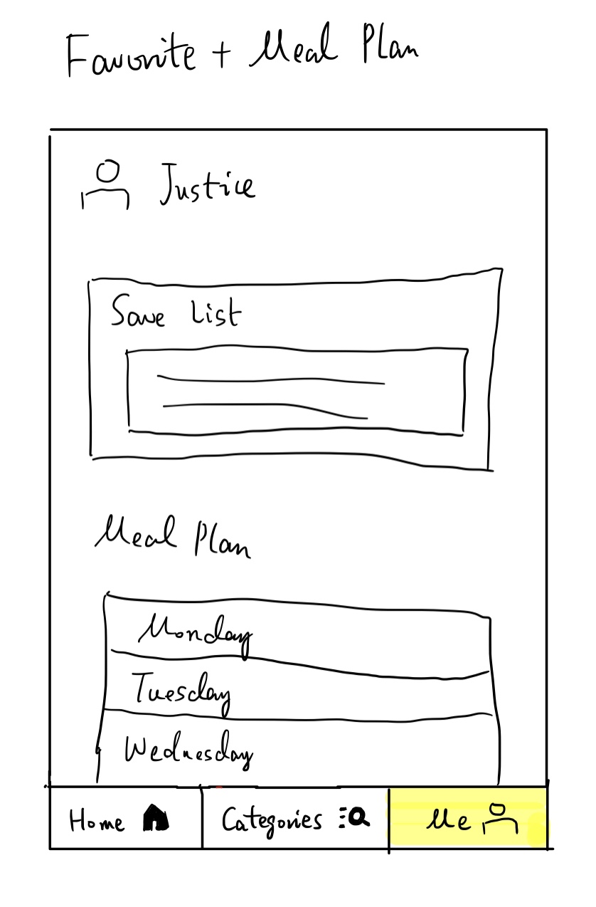
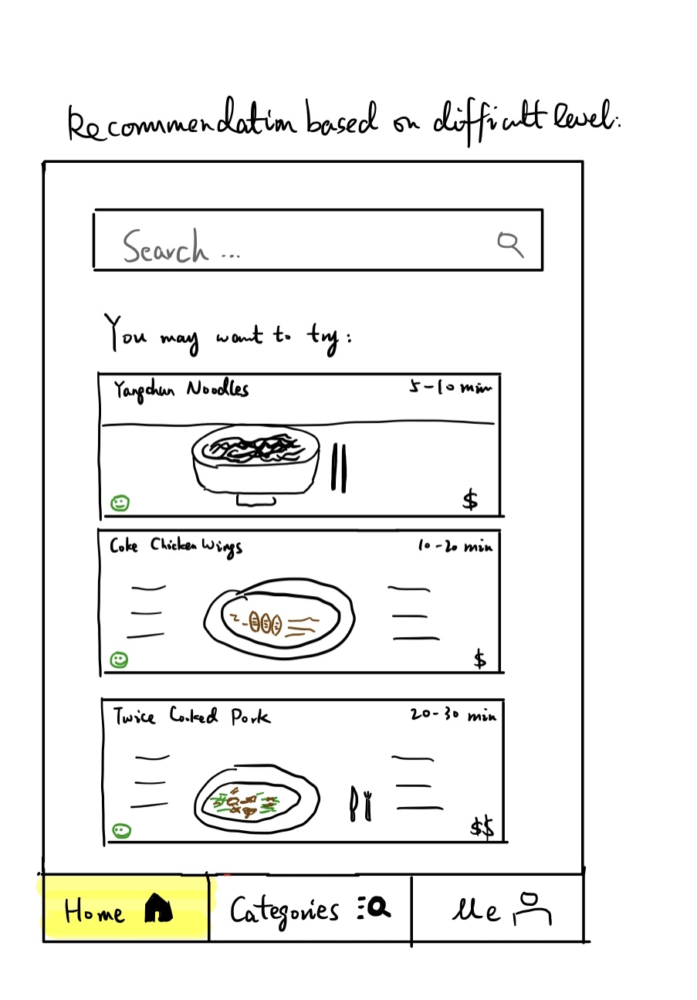

# Milestone 3: Design

# Overview

- Project's Name: Recipe Finder
- Team Members Name: Ada Chai, Xuanhui Chen, Hedy Yang, Xinlu Zhou
- Project's choice of focus
    - Budget-friendly. Take advantage of filters and enable users to plan meals according to an inputted budget amount. 
    - Time-conscious. Rethink meal planning and allow users to customize their meals of the day by filtering recipes based on expected time. 
- Outline of the content
    - Milestone 2 Revisions
    - Persuasive Design
    - Brainstorming
    - Sketches
    - Paper Prototype & Evaluation
    - Final Sketches / Wireframes
    - Rationale

# Revisions 

We made the following revisions on the "Milestone 2: Discovery and Planning" document based on the feedbacks from Neta and Kyle. The title of the revised sections starts with "[Revised]" and can be located from the README.md file.

- Revision 1: "0. Overview"
    - Why we changed: We did not have a project description / milestone opening, and it would be inconvenient for readers to quickly get a sense of what's happening.
    - What we changed: We added the project overview at the beginning of the document, including project's name, team members' names, project's choice of focus, table of content/outline of the content.
- Revision 2: "1. Users - Brainstorming the User"
    - Why we changed: We mispresented the process of brainstorming, and it looked like we added our own experience.
    - What we changed: We rewote the first sentence. The revised version is: "Below is the list of possible user groups, characteristics, and problem spaces our team generated".
- Revision 3: "2. Gather Information"
    - Why we changed: We placed the interview protocol and questions in the body of the milestone 2 file, but they should be added as supporting documents.
    - What we changed: We moved the interview protocol and questions to the "Additional Items" sections as supporting documents. We also noted the location of these two files in the body of milestone 2 for the readers' convenience.
- Revision 4: "2. Gather Information - Affinity Diagram"
    - Why we changed: We did not explain the meaning of the different colors.
    - What we changed: We explained the meaning of the different colors by adding this sentence at the end of the first paragraph: "Note that different colors represent different users."
- Revision 5: "4. Value Propositions"
    - Why we changed: We wrote the value proposition as a paragraph and it was not as effective as bullet points to communicate.
    - What we changed: We formatted the paragraph as a bullet list.
- Revision 6: "5. Scenarios"
    - Why we changed: We wrote the scenarios as we would for a task in a user study.
    - What we changed:
        - We used a more general desciption: "Robo tends to be very busy during the midterm week so she can’t afford to spend more than 30 minutes on cooking each meal, she wants to save enough time for studying" 
        - We described users performing task: "Robo explores hometown recipes in the new recipe app and she quickly found one of her favorite hometown dishes that is easy to cook and total expenses are under her budget. "
        - We finished the scenaios by describing users feeling: "Robo feels relieved and happy after she finds easy and fast recipes to follow next week." "Robo feels so happy and decides to start cooking right away."

# Persuasive Design
When designing to influence your users’ behavior, use the Fogg Behavior Model (FBM): https://www.behaviormodel.org. The FBM has three dimensions: Motivation, Ability (Simplicity), and Prompts (Triggers). Think about each of these dimensions especially during your brainstorming and sketching activities.

When identifying the behavior you wish to influence, think small. Don’t try to solve global warning, instead encourage users to bring reusable bags. Select the smallest, simplest behavior that matters.

Next, find what prevents the target behavior. This is typically a combination of the following factors:

lack of motivation
lack of ability
lack of well-timed prompt to perform the behavior
Lastly, identify relevant examples of persuasive technology and imitate them. This may be a badge system, scavenger hunt, score card, etc.

Clearly explain your persuasive design approach, what behavior you are trying to influence, and how your design accomplishes that. Document everything and commit the documentation to your repository.

After defining our target users and key problems, we need to contemplate what we want users to do and design the flow to persuade users to take action. To better come up with the solutions that can elicit the desired actions, we decided to analyze our users’ behavior with the Fogg Behavior Model. 
Based on the persona that we’ve created in milestone 2, we first indicated the behavior we wish to influence is to help user find a desired recipe quick & start cooking right away. And we pointed out that the two biggest barriers for users are lack of time and budget, and inefficiency to find satisfying recipes. This led us to further infer that the motivation, ability, and prompts that would affect our users’ final decision and behavior below. 

From above, we understood that the main potential barriers that prevent people from our target behavior are consumption of time/budget and complexity of the recipes. Thus, we came up with several persuasive technologies that can make users perceive the saving of time/budget, decrease the effort they need to cook dishes, promote the efficiency of finding recipes, and various forms of positive rewards after cooking. We want to use those persuasive technologies to change the altitude of users on cooking and encourage them to cook more often. Badge and reward system can record user's behaviors on app and give them corresponding incentives once they get some accomplishments, which could significantly build users’ confidence on cooking and inspire them cook more often. As for report system and score card, these can reflect the total time and budget users have been spent on cooking, and we believe those specific data can make users perceive the benefits from cooking more straightforward. Shopping list can ensure no ingredients are missing while users are cooking. Finally, if users can see recipes that friends have been followed or recommended, they may more likely to try those recipes and cook.

# Brainstorming
Before you design anything, you need to explore the design and solution space of your problem. Explore the space by brainstorming with your team. Brainstorming is about ideas.

Document your brainstorming session and commit the documentation to your repository. We want to see photos of whiteboard brainstorming1

From that, we started brainstorming different ideas as a team that can bring positive behavioral change by either increasing position motivators and simplicity or eliminating factors of demotivation. In this case, we intend to help users better plan their meals by shortening the time of finding quick and cheaper recipes and enabling users to cook with low effort. Then, we brainstormed ideas individually and categorized similar ones into groups.  After coming up with 37 ideas, we decided to use the Impact & Effort matrix template to prioritize them in order of importance and assess their feasibility. Therefore, we will focus on two groups of ideas which are “favorites” and “using imagery/media/audio” that fall in the upper left area of the quadrant to sketch up preliminary sketches.

## Solution Space

After grouping all of our ideas together, we sorted our solution spaces based on effort and impact. As a result, we found that the following 4 concepts / characteristics were our major projects:
- meal plan
    - Part of saving time while cooking is meal planning. This includes batch cooking, or planning the meals one will eat each day. Therefore, we considered this a feature that would be important for our users to have.
- filter / category system  
    - Since users mainly wanted to save time and money while cooking, we considered having filters / categories as a priority. Users could then filter through the recipes in our app based on time, number of ingredients, equipment needed, and budget. Limiting ingredients and equipment needed simplifies the process and makes it more efficient.
- "real" home food recipes
    - We wanted some means of allowing users to input their own recipes 
- recommendation system
    - We wanted some way to recommend recipes to our users based on the app. These are generated based on what the user chooses to cook, what they mark down in their favorites, and how many times they have cooked similar recipes.

- Favorites:
To like a recipe and save it for future reference brings users lots of convenience by saving them the re-searching time. This functionality does not require much effort to achieve, so it is a low effort, high impact task

- Using imagery/media/audio:
Implementing recipes with images or videos will make the recipes more vivid and show the users what the dish will look like. Tutorial videos provide an alternative option for users who don’t like reading instructions. This functionality does not require much effort to achieve, so it  is a low effort high impact task.

We discarded the following three concepts based on effort and impact:
- Social activity
    - Even though it is a good idea, for it may be both a motivator and home food collector, it needs super high efforts to implement this solution, e.g., large data set.  On the other hand, it has low impacts: it is not the primary goal of our recipe app because we want to focus on recipe findings that meet our users' needs.
- Availability of kitchens/ingredients
    - It needs super high efforts but low impacts because other efficient apps have similar goals, e.g., delivery apps like instacart. Implementing this solution requires collecting related information from different apps/grocery shops.
- Calculation/conversion
    - It needs moderate-high efforts but low impacts because it is unnecessary and not the focal point of our recipe app. It is more efficient to use other apps with similar functions. Implementing calculation/conversion solutions will possibly sacrifice other functions of our product.

# Sketches
Provide a caption for each sketch explaining it.

With your fresh set of ideas from brainstorming, sketch up some preliminary designs and generate more ideas about how you might solve this problem. Remember that sketching is primarily about generating ideas too… it’s just a little more focused than brainstorming. Your sketches should reflect the ideas that you explored in your design space.

- Filter

Title: filtering system

Idea: Showing approximate time cost and budget, difficulty level, and recipe name with a food image as background on each recipe card, which is straightforward and conspicuous. Including drop down menus for both sorting and filtering system. The search bar is on the top of the home page. The default sorting system sort time consuming for each recipe because it is the most important key problem in ascending order.

- Favorites + Meal Plan

Title: favorites and meal plan function in profile page

Including both saved list of recipes and meal plan in the profile page because they are user personalized functions. Meal plan are designed to set weekly.

- Recommendation System

Title: recommendation system as the default page

The default recommendation system analyzes what recipes users would like based on their past choices and sort time consuming for each recipe because it is the most important key problem in ascending order.

**Note: Please refer individual links in the table of contents for extra works building up the paper prototype, listed under the "Additional Items" section.**

## Final Sketches

# Rationale

Our app includes 3 main functions:
- meal planning: 
    - Users can choose a date and add a recipe for each meal of the day (breakfast, lunch, dinner). Adding a recipe brings them to a browsing page, where they can filter their options based on their personal constraints. If they click an image, it will lead the user to a recipe card, where it will display the time needed, estimated cost of the meal, ingredients, cooking ware, and recipe itself. Users can indicate whether they've cooked a meal by clicking the "cooked" button; they can also schedule a meal that they found by selecting "add to meal plan." 

- favorites: 
    - This is where the user's saved recipes are stored. They can browse their favorited recipes from the app or view the recipes they uploaded and/or recorded themselves, perhaps from a family member or a friend.
    - If users choose to record their own recipe, they can fill out a recipe card template to make the process more efficient.
- profile page
    - Users can view badges they've earned and a report of their cooking statistics from the week. 
    

The app solves our user's key problems by allowing the user to jump straight into meal planning on the landing page of the app. They can immediately start selecting recipes for each meal of the day, and filtering recipes based on time, budget, and cuisine, which solves our user's key problems of time and money for cooking. Additionally, our "favorites" section features an opportunity for users to record their own home recipes from family and friends, as well as saving recipes from the app that remind them of home, solving the key problem of users missing familiar recipes. 

The app influences user behavior by persuading them to plan ahead and encouraging them to cook more often. Planning ahead will save them time and money, as they won't be forced to buy takeout, or make as many meals impromptu because they will have already planned and prepared their meals beforehand. Additionally, the badge system and cooking metrics will reinforce a positive feedback loop, where the user sees the achievements they've earned and will encouraged to cook even more often.

Our design effectively communicates with the user because the user can ask for more information as needed, similar to a normal conversation. For example, recipes are not immediately displayed - users have to click recipe images to find out more details. Additionally, the communication on the navigation bar is clear, as each function and icon is labeled with its purpose. 

Thus, we meet our target audience's goals by allowing them to save money, time, and quickly access home recipes as needed using our app, effectively satisfying the scenarios we wrote beforehand.