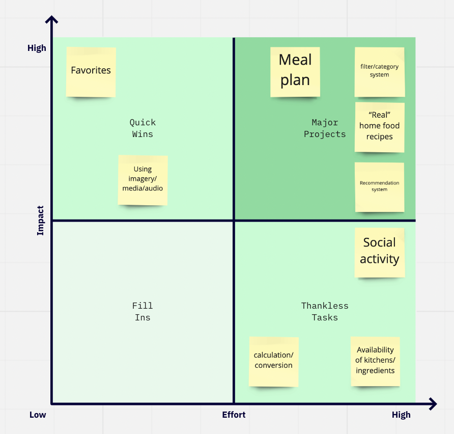

# Design

# Revisions 
If you need to make revisions to your previous milestones artifacts, make that clear in your submission. Explain what new information you gained that required you changing these artifacts, etc.

In the table of contents, clearly explain what you revised, when, why, and what you changed.

# Persuasive Design
When designing to influence your users’ behavior, use the Fogg Behavior Model (FBM): https://www.behaviormodel.org. The FBM has three dimensions: Motivation, Ability (Simplicity), and Prompts (Triggers). Think about each of these dimensions especially during your brainstorming and sketching activities.

When identifying the behavior you wish to influence, think small. Don’t try to solve global warning, instead encourage users to bring reusable bags. Select the smallest, simplest behavior that matters.

Next, find what prevents the target behavior. This is typically a combination of the following factors:

lack of motivation
lack of ability
lack of well-timed prompt to perform the behavior
Lastly, identify relevant examples of persuasive technology and imitate them. This may be a badge system, scavenger hunt, score card, etc.

Clearly explain your persuasive design approach, what behavior you are trying to influence, and how your design accomplishes that. Document everything and commit the documentation to your repository.

# Brainstorming
Before you design anything, you need to explore the design and solution space of your problem. Explore the space by brainstorming with your team. Brainstorming is about ideas.

Document your brainstorming session and commit the documentation to your repository. We want to see photos of whiteboard brainstorming1

## Solution Space

After grouping all of our ideas together, we sorted our solution spaces based on effort and impact. As a result, we found that the following 4 concepts / characteristics were our major projectS:
- meal plan
    - Part of saving time while cooking is meal planning. This includes batch cooking, or planning the meals one will eat each day. Therefore, we considered this a feature that would be important for our users to have.
- filter / category system  
    - Since users mainly wanted to save time and money while cooking, we considered having filters / categories as a priority. Users could then filter through the recipes in our app based on time, number of ingredients, equipment needed, and budget. Limiting ingredients and equipment needed simplifies the process and makes it more efficient.
- "real" home food recipes
    - We wanted some means of allowing users to input their own recipes 
- recommendation system
    - We wanted some way to recommend recipes to our users based on the app. These are generated based on what the user chooses to cook, what they mark down in their favorites, and how many times they have cooked similar recipes.
 

- Favorites:
To like a recipe and save it for future reference brings users lots of convenience by saving them the re-searching time. This functionality does not require much effort to achieve, so it is a low effort, high impact task

- Using imagery/media/audio:
Implementing recipes with images or videos will make the recipes more vivid and show the users what the dish will look like. Tutorial videos provide an alternative option for users who don’t like reading instructions. This functionality does not require much effort to achieve, so it  is a low effort high impact task.

# Sketches
With your fresh set of ideas from brainstorming, sketch up some preliminary designs and generate more ideas about how you might solve this problem. Remember that sketching is primarily about generating ideas too… it’s just a little more focused than brainstorming. Your sketches should reflect the ideas that you explored in your design space.

# Paper Prototype
You’ll need to evaluate your preliminary design to make sure it’s meeting your users’ needs before you spend the effort to build it. You should produce a paper prototype of your design and test it with your target audiences.

Paper prototypes are implemented with paper. No part of this should be digital. You should draw out your prototype on physical paper and test it. You may not use a sketching program to “print” out your prototype and test it.

You must test your design with a minimum of 4 distinct users. You should evaluate each scenario you identified in the previous milestone for all users.

Document your testing, results, etc. and submit them to your repository. You are required to include your user testing notes and the debrief from your testing. All artifacts should be logically organized in your table of contents and should be easy to find.

# Final Sketches
Using the results of your user testing, refine your design. Produce a set of final sketches (wireframes are acceptable here; mock-ups are not) of your app’s design. These sketches will be your “blueprints” for the next milestone.

Connect the different screens of your app with arrows. These arrows should show the flow through the app.

Note: You are only required to submit final sketches. Save yourself the time and don’t bother with anything nicer. Yes Figma is fun, but it’s not going to get you any extra points here. Final sketches are all that you need for full credit. Be smart with your time… that’s what professionals do!

# Rationale
Briefly explain your app’s design, how it solves the key problems you identified in the previous milestone, and how it influences user behavior. Use “conversations” to justify why your design effectively communicates with your users (See Chapter 5: The Design Process.)

Tip: How does your final design meet the goals of your users through the lens of the scenarios you identified in the previous milestone?

This should probably be around a few paragraphs. There is no length requirement. If you can explain your design, whether it effectively communicates with your users, and how you know it meets your target audiences goals, then you’ve done what you’re suppose to do.