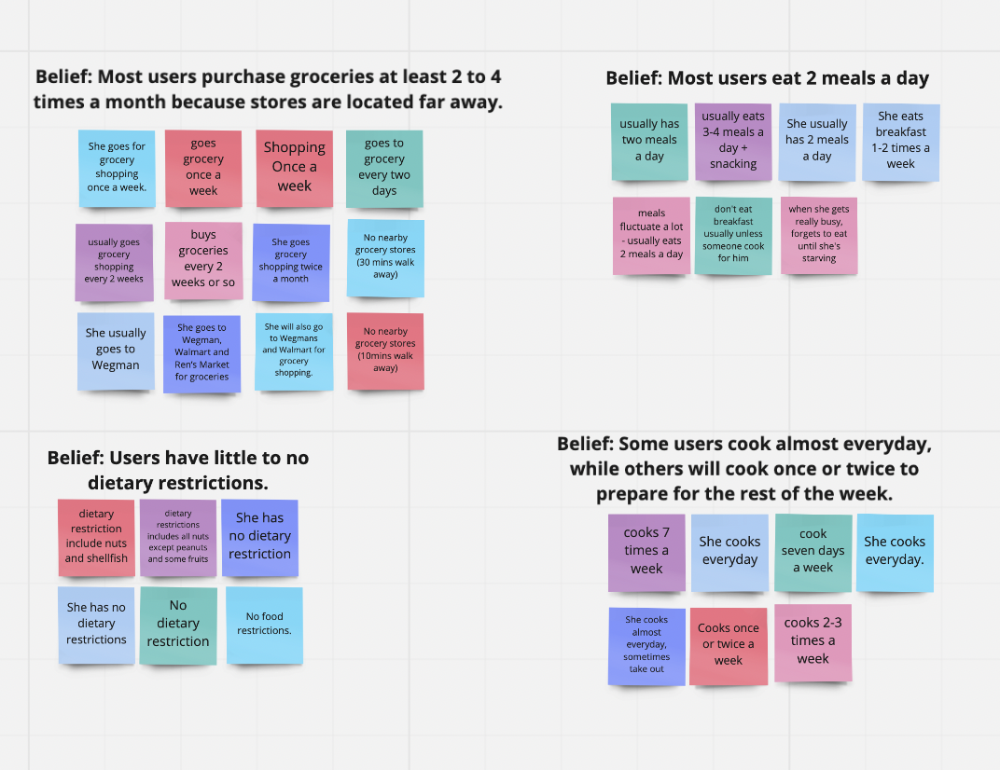
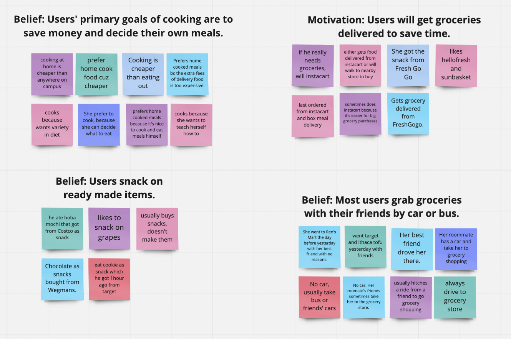
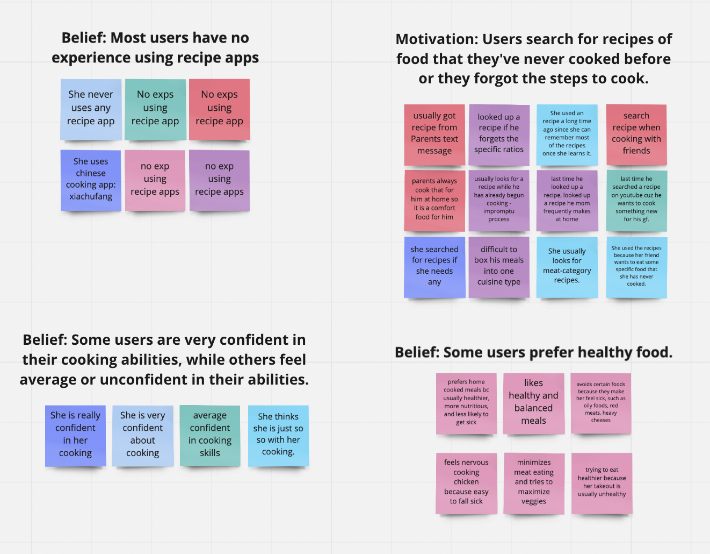
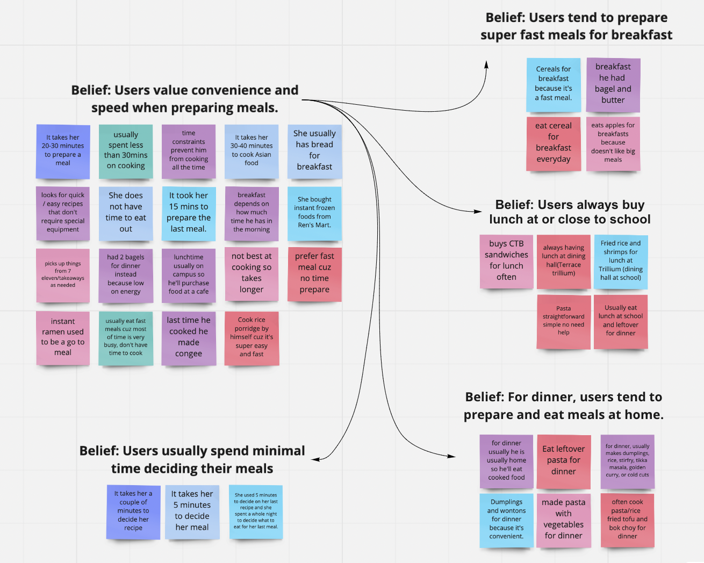
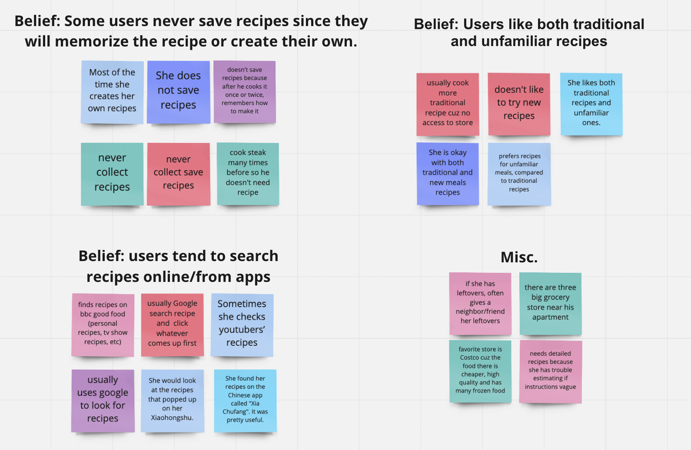
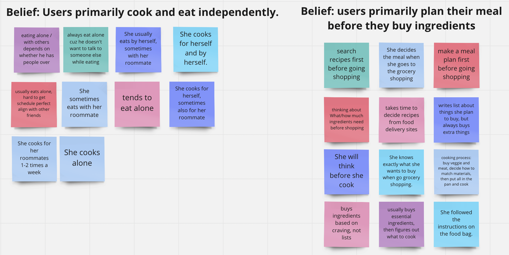
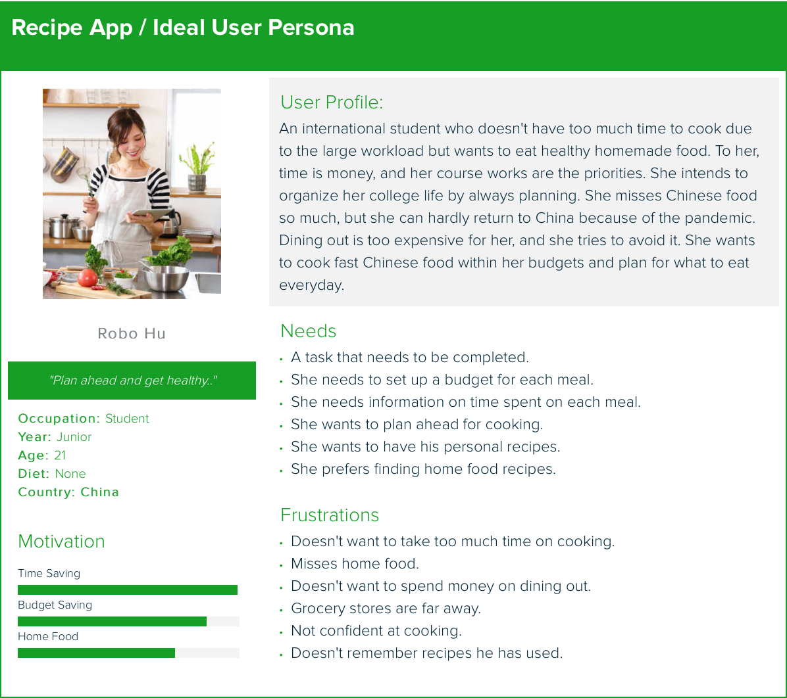

# Discovery and Planning

# 1. Users
We first brainstormed our possible users. Then we conducted 1 round of unstructured interview to finalize our target users. The detail of this interview can be found in the "User Interview Summaries" section below.

## Brainstorming the User 
- College students who often cook at their apartments
- Housewife who prepares food for her family
- Cook
- Students who volunteer at non-profit organizations to serve the homeless
- Adults who hold party at home and treat their friends for a holiday / special occasion
- Bloggers/Youtubers/Vloggers who produce cooking videos.
- Quarantined people who try to learn how to cook at home.
- Students who are trying to recreate their favorite foods from applefest
- People start learning how to cook
- College students who need healthy meals
- E.g. college students who enjoy drinking
- College students
- Possible restrictions: vegetarian / vegan / dietary restrictions / pescitarian / gluten-free
- Cooking beginners
- learning how to cook 
- no meal plan
- need healthy meals
- saving money 
- efficiency?
- ppl who would be interested in meals from where they’re from 
- dessert finder
- College students, faculty, high school students, family members, Ithaca staff members

## Target Users
students living off campus trying to cook efficiently, save money, and eat healthy and delicious meals.
	

# 2. Gather Information
You should collect information from at least 6 users (graduate teams). 
Clearly state how many users you interviewed/studied. Provide a brief summary of each user and what you learned from them. Lastly, provide an executive summary of key points that you learned about the users’ goals. Note, you will need to use affinity diagramming (document this process with photos) to help you identify themes in your data.

Interview Expected Time: 30 minutes

## Interview Protocol 

Hi, thank you for joining us today. The purpose of this interview is to better understand the users’ needs for a recipe finder. Is it okay if we record this interview today? [Start Zoom recording or audio recording if consent is received. 

## Interview Questions

### Round 1: Unstructued Interview
- Do you cook? 
    - Why or why not?
- [If yes] Describe to me your process of cooking
- How do you find your recipes?
- Any dietary restrictions?

### Round 2: Semi-Structured
#### (1) Personal questions (random icebreaker)
- What is your name, age, major?
- Where do you live off campus (e.g. North, West, Collegetown, etc)?
- Is there any grocery store nearby?
- Do you have a car? 
- If not, how do you go grocery shopping?

#### (2) Eating Habit
- Do you prefer home cooked meals or fast meals? Why?
- Do you have any dietary restrictions?
- Do you often eat alone or with other people?
- What did you last have for breakfast? For lunch? For dinner?
- [Based on response] How often do you have that for breakfast? Lunch? Dinner?
    - [Follow up questions about who, where, when, why, how, etc] 
- Is this the same number of meals that you have regularly?
- What kind of food do you usually eat? Fast food? Asian food?
- When was the last time you snacked?
- What did you have?
- Where did you buy it?

#### (3) Cook Related
- When was the last time you cooked?
- What did you cook?
- Who did you cook with?
- Where did you cook?
- Why did you cook?
- How did you cook (i.e. cooking process)?
- How long have you been cooking?
- How often do you cook?
- What kind of food do you usually cook? Easy, Intermediate or elaborate?
- How long did it take you to prepare your last meal? 
- Do you cook for yourself or do this for someone else?
- Do you cook by yourself or do this with someone else?
- How confident are you in your cooking? 

#### (4) Recipes
- Do you have any experience using recipe apps? 
- If so, which one and how was your experience? 
- When was the last time you looked for a recipe?
- What occasion was it for?
- How did you find the recipe?
- Do you like traditional recipes or do you like to experiment with more unfamiliar meals?
- Do you collect/save different recipes?
- How do you save your recipes?
- How much time did it take you to decide on your last meal/recipe?
- What types of recipes do you usually look for? 

## User Interview Summaries

Overall, we interviewed 15 users - 8 users in our first round of interviews, and 7 users in our second round of interviews. Our first round was more unstructured, in that we held brief 5 minute conversations with peers we could find around us, such as roommates, classmates, those walking around in Duffield, etc. After we looked at our insights for the first round, we narrowed down a user group and created an interview protocol so that we can pinpoint some specific insights from our target users. Below are 

Round 1: Unstructured

Round 2: Semi-structured
- User 1: 
- User 2: The user was a female graduate student currently living in Collegetown. We learned that she prioritizes convenience and frequently uses meal delivery services such as HelloFresh and SunBasket. She is not confident in her cooking skills and is trying to best to teach herself. She cooks in order to eat healthier and to save money.

- User 3: The user was a male graduate student currently living in Collegetown Terrace. He has several dietary restrictions, including nuts and various fruits. We learned that he is relatively confident in his cooking skills, and cooks on a daily basis, doesn't really have a budget when cooking, and oftentimes finds himself looking up recipes for dishes his mom used to prepare for him, in order to double check details such as sauce ratios. He cooks because he enjoys having control over his diet. 

- User 4: The user was a female graduate student currently living in North side of campus. We learned that she is very confident at his cooking and she cooks everyday. She does not have a budget for grocery. She eats 2 meals a day, and it usually takes her 5 minuts to decide the recipe and 30-40 minutes to prepare a meal. Most of the time she creates her own recipes, and sometimes she will search recipes on YouTube or Xiaohongshu. She cooks because she wants to eat Asian food and cooking is much cheaper than dining out.

- User 5: The user was a female graduate student currently libing in Collegetown Terrace. We learned that she started cooking since middle school, and she cooks almost everyday. She is very condifent about cooking. It takes her 20-30 minuts to prepare a meal, and she searches recipes on Xiachufang. She does not have a budget on grocery and dining out. She likes to cook because she can decide what to eat.

## Affinity Diagramming

We created an affinity diagram based on our user interview notes. We categorized our notes as seen in the images provided:

## Executive Summary: Key Insights
- Beliefs
    - Most users purchase groceries at least 2 to 4 times a month because stores are located far away
    - Most users eat 2 meals a day
    - Users value convenience and speed when preparing meals
        - Users tend to prepare super fast meals for breakfast
        - Users always buy lunch at or close to school
        - Users tend to prepare dinner and eat at home
        - Users usually spend minimal time deciding their meals
    - Users have little to no dietary restrictions
    - Some users cook almost everyday, while others will cook once or twice to prepare for the rest of the week. 
    - Users primarily cook and eat independently
    - Most users started cooking when they began college.
    - User primarily plan their meals before buy ingredients
    - Some users are very confident in their cooking abilities, while others feel average or unconfident in their abilities. 
    - Users tend to search recipes online or from apps.
    - Users have a preference for foods that are familiar to them and/or remind them of home
    - Some users never save recipes since they will memorize the recipe or create their own.
    Users primarily have no strict budgets for grocery but they avoid dining out.
    - Users like both traditional and unfamiliar recipes.
    - Users primarily plan their meal before they buy ingredients.
    - Users snack on ready made items.
    - Most users grab groceries with their friends by car or bus.
    - Most users have no experience using recipe apps.
    - Some users prefer healthy food.
- Motivations
    - Some users tend to save recipes on their phones or in apps for convenience.
    - Users search for recipes of food that they've never cooked before or they forgot the steps to cook 
    - Users will get groceries delivered to save time. 

# 3. Problems
 identify 1 or 2 key problems that your team wants to address. 

# 4. Value Propositions

Brainstorming: 
    Should contain: 
    - Target users + their motivation(s) for using a product / feature
    - The alternatives
    - Benefits of the product / feature (compared to the alternatives)
    - Costs (e.g. money, time, etc) (compared to alternatives)
    - Why target users will prefer the product / feature over alternatives

    Tips:
    - Sounds like smth target users would say

    Possible ideas: 
    - Insert budget
    - How much time you have to prepare
    - Customize app to their experiences
    - filters/categories for recipes - e.g. chinese, american, etc
    - Plan meals - don't have to think about dinner / lunch - better control time + budget

Value Propositions:
College students want to save money and time at eating, and they need healthy and delicious meals that can be prepared quickly in their apartments. They need such a product that help them cook delicious meals quickly within the budget. The current alternatives students have are recipe apps like BBC good food and Xiachufang. Users can upload their own recipes, check the chef-made recipes and tutorial videos in the app. These apps have the limit that they cannot help users to plan the time and money spent on cooking. But our product can do that. Our product can filter the recipes by the country category, budget, and time of cooking. After users insert their weekly grocery budget, the time planned on preparing meals, and the food category, the app will create a list of ingredients and the recipes for each meal of the week. Users can purchse all of these ingredients in one grocery shopping, and the product will remind them of the recipe before each meal. A customized meal plan is designed for you in just a few clicks, and this feature is only in our product.

# 5. Scenarios
Produce a scenario for each key problem/value proposition. Note you will likely need more than one scenario.

# 6. Persona

Name: Tim Cook
Quote: "Plan ahead and get healthy."

Occupation: Student
Year: Junior
Age: 21
Diet: None
Country: Spain

Motivation:
- Time Saving
- Budget Saving
- Home Food

User Profile:
An international student who doesn't have too much time to cook due to the large workload but wants to eat healthy homemade food. To him, time is money, and his course works are the priorities. He intends to organize his college life by always planning. He misses Spanish food so much, but he can hardly return to Spain because of the pandemic. Dining out is too expensive for him, and he tries to avoid it. He wants to search for recipes that list budgets, the time needed; find recipes under specific cuisines categories, and build up a meal plan.

Needs:
- He needs to set up a budget for each meal.
- He needs information on time spent on each meal. 
- He wants to plan ahead for cooking.
- He wants to have his personal recipes.
- He prefers finding home food recipes.​

Frustrations:
- Doesn't want to take too much time on cooking.
- Misses home food.
- Doesn't want to spend money on dining out.
- Grocery stores are far away.
- Not confident at cooking.
- Doesn't remember recipes he has used.​​

# 7. Project Themes

Our Recipe Finder project themes include the following:
- Mobile-responsive. Develop an app that is responsive both on desktop and mobile. 
- Budget-friendly. Take advantage of filters and enable users to plan meals according to a filter based on budget. 
- Time-awareness. Rethink meal planning and allow users to further adjust their meal planning by allowing users to select meals based on time. 
- Performance. Make it easy for users to navigate and find recipes that remind them of home. 