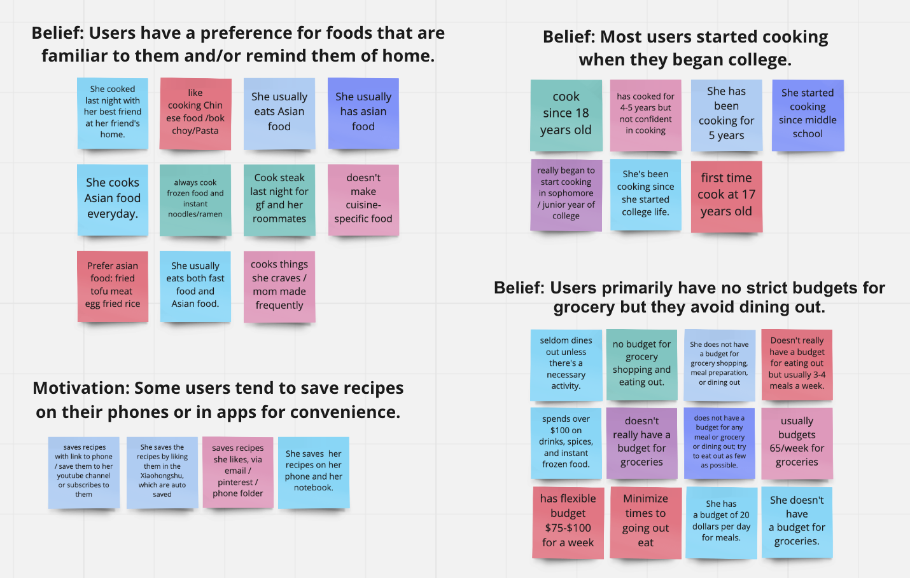

# Milestone 2: Discovery and Planning

# [Revised] 0. Overview
- Project's Name: Recipe Finder
- Team Members Name: Ada Chai, Xuanhui Chen, Hedy Yang, Xinlu Zhou
- Project's choice of focus
    - Budget-friendly. Take advantage of filters and enable users to plan meals according to an inputted budget amount. 
    - Time-conscious. Rethink meal planning and allow users to customize their meals of the day by filtering recipes based on expected time. 
- Outline of the content
    - Users
    - Gather Information
        - User Interview Summaries
            - Round 1: Unstructured Interviews
            - Round 2: Semi-structured Interviews
        - Affinity Diagramming
        - Executive Summary: Key Insights
    - Problems
    - Value Propositions
    - Scenarios
    - Persona
    - Project Themes

# 1. Users

To develop our user group, we first brainstormed and listed possible users, characteristics, problem spaces. Many ideas included college students because they were our most accessible group for interviews, and so we decided to choose college students as our target users for the first stage. Then, in order to narrow down our project scope, we tried to make a Google survey to gather information about their experience with cooking and finding recipes. However, we received feedback from a TA that suggested we use a more efficient UX research method by conducting several brief, unstructured interviews with individuals who we could find immediately around us, in order to figure out their pain points and needs. Thus, for our first round of user research, we conducted 8 user interviews and then came together as a team to discuss the insights. This led us to the target user group we found below. We have included our summaries and raw notes for each user in the "User Interview Summaries" and "Additional Items" section.

## Target Users
Students living off campus trying to cook efficiently, save money, and eat healthy and delicious meals.

## [Revised] Brainstorming the User

Below is the list of possible user groups, characteristics, and problem spaces our team generated:
- College students who often cook at their apartments
- Housewife who prepares food for her family
- Cook
- Students who volunteer at non-profit organizations to serve the homeless
- Adults who hold party at home and treat their friends for a holiday / special occasion
- Bloggers/Youtubers/Vloggers who produce cooking videos.
- Quarantined people who try to learn how to cook at home.
- Students who are trying to recreate their favorite foods from applefest
- People start learning how to cook
- College students who need healthy meals
- E.g. college students who enjoy drinking
- College students
- Possible restrictions: vegetarian / vegan / dietary restrictions / pescitarian / gluten-free
- Cooking beginners
- learning how to cook 
- no meal plan
- need healthy meals
- saving money 
- efficiency?
- ppl who would be interested in meals from where they’re from 
- dessert finder
- College students, faculty, high school students, family members, Ithaca staff members

# [Revised] 2. Gather Information

After our initial round of interviews, we decided to conduct more in-depth interviews in order to gain more specific insights about the goals, beliefs, and motivations of our users. Thus, our team worked together to draft a interview protocol, which included a script to introduce and end the interview, and a set of questions, building from personal questions to questions related to grocery shopping, cooking, and recipe finding habits. We anticipated interviews might take around 30 minutes, based on the questions we deemed necessary to ask.

Interview Expected Time: 30 minutes

## [Revised] Interview Protocol 

Please see individual links in the table of contents for interview protocal, listed under the "Additional Items" section. 

## [Revised] Interview Questions 

Please see individual links in the table of contents for interview questions, listed under the "Additional Items" section. 

## User Interview Raw Notes

Please see individual links in the table of contents for raw interview notes, listed under the "Additional Items" section. 

## User Interview Summaries

Collectively, we interviewed 15 users - 8 users in our first round of interviews, and 7 users in our second round of interviews. Our first round was unstructured, in that we held brief 5 minute conversations with peers we could find around us, such as roommates, classmates, those walking around in Duffield, etc. After we looked at our insights for the first round, we narrowed down a user group and created an interview protocol so that we can pinpoint some specific insights from our target users in the second round. We have included our raw notes and summaries for each user below.

### Round 1: Unstructured Interviews

- User 1: She cooks because she wants to save money as a student. She is methodical when cooking; her process includes: defrosting ingredients, checking out what's in the fridge, preparing the ingredients, and then cooking. She doesn't actively look for new recipes; instead she relies on recipes she already knows, either taught by her parents or ones that she makes frequently. She doesn't have any dietary restrictions. She cooks 2 to 3 times a week, meal prepping for the rest of the week. She eats lunch on campus so her meals do not get boring. 

- User 2: He cooks because it's cheaper than going out to eat everyday. There are 5 recipes he knows by heart that he reuses over and over. Every week, he thinks about what he wants to eat, then buys the respective groceries and spends around 3 hours cooking. These recipes are the ones he learned from his parents. He always aims to cook simple recipes. Because he does not have a lot of experience cooking, he looks for recipes that take the least amount of time and the fewest number of ingredients. He has dietary restrictions to various nuts and shellfish.

- User 3: He cooks because he wants to save money and time while he is a student. He also said cooking is a very relaxing time for him. He remembers about 10 food recipes that he often used to cook. His cooking process is: decide recipe first, buy ingredient, cook for 1 hour cooking maximum, and clean dish. Personally, he prefers recipes on YouTube than documents. He has no dietary restrictions.

- User 4: She cooks because the food in school dining hall and restaurants near apartments are not delicious. She also emphasized that cooking at home is much cheaper than dine-out. She would only searched for recipes that she’ve never cooked before. Her cooking process: buy ingredient first, decide what to cook based on available ingredients on hand. She tend to cook quick food everyday but she also has high requirement of food taste. She has no dietary restrictions but doesn’t eat food that contain high carbs and sugar.

- User 5: She cooks because there is a limited number of Uber drivers for food delivery in Ithaca. Her cooking process is: find recipes, buy ingredients, and cook. She uses the recipe apps Xiachufang. She has no dietary restrictions.

- User 6: She cooks because the food in the school dining hall sucks and it’s expensive to order Chinese food in Ithaca. Her cooking process is: slide everything first, and then basically stir fry everything. She follows the recipes on Xiaohongshu, where she can just type in what she has in her fridge like potatoes and see how she could cook it. She has no dietary restrictions.

- User 7: She cooks because Ithaca does not have many delicious Asian foods, and cooking by herself is healthier and cheaper than dining out. Her cooking process is: going grocery shopping, deciding what to eat, finding recipes and making changes according to her own flavor, and lastly following the instructions on the recipes. Basically she follows the recipes on Xiachufang. She has no dietary restrictions.

- User 8: She cooks because cooking is definitely healthier and cheaper than going to the restaurants and ordering food deliveries. She cooks based on her past experiences in which she found the recipes on Xiaohongshu. If she can’t remember the recipes, she will look up recipes she saved on Xiaohongshu again. She mainly used Xiaohongshu to find recipes. She has no dietary restrictions.

### Round 2: Semi-structured Interviews

- User 1: The user was a male graduate student currently living in Collegetown Terrace. He has several dietary restrictions, including nuts and shellfish. We learned that he usually eats at school and cooks once or twice a week, also he would save leftover for the next meal. He only cooks limited dishes that he’ve been made several times before and prefers food with straightforward cooking step. In addition, he likes to cook food that his mom used to prepare for him and he would asked his parents for recipe by text message. He has a flexible budget for weekly grocery shopping but will minimize times to going out to eat.

- User 2: The user was a female graduate student currently living in Collegetown. We learned that she prioritizes convenience and frequently uses meal delivery services such as HelloFresh and SunBasket. She is not confident in her cooking skills and is trying to best to teach herself. She cooks in order to eat healthier and to save money.

- User 3: The user was a male graduate student currently living in Collegetown Terrace. He has several dietary restrictions, including nuts and various fruits. We learned that he is relatively confident in his cooking skills, and cooks on a daily basis, doesn't really have a budget when cooking, and oftentimes finds himself looking up recipes for dishes his mom used to prepare for him, in order to double check details such as sauce ratios. He cooks because he enjoys having control over his diet. 

- User 4: The user was a male graduate student currently living in Boston. Even though he lives nearby a lot of restaurants and big grocery stores, he chooses to cook fast food becuase it can save his money and time. In weekdays, he always eats alone and spends less than 30 mins on cooking by heating up frozen food or making instant noodle. However, he would search new recipes on youtube when he intends to cook for his friends and family. He is average confident in his cooking skills. He does not have a strict budget on grocery and dining out. 

- User 5: The user was a female graduate student currently living in North side of campus. We learned that she is very confident at her cooking and she cooks everyday. She does not have a budget for grocery. She eats 2 meals a day, and it usually takes her 5 minutes to decide the recipe and 30-40 minutes to prepare a meal. Most of the time she creates her own recipes, and sometimes she will search recipes on YouTube or Xiaohongshu. She cooks because she wants to eat Asian food and cooking is much cheaper than dining out.

- User 6: The user was a female graduate student currently living in Collegetown Terrace. We learned that she started cooking since middle school, and she cooks almost everyday. She is very condifent about cooking. It takes her 20-30 minutes to prepare a meal, and she searches recipes on Xiachufang. She does not have a budget on grocery and dining out. She likes to cook because she can decide what to eat.

- User 7: The user was a female graduate student currently living in North side of campus. She is just so so with her cooking skills even though she has been cooking since she started her college life. She loves Asian food and cooks Asian cuisines everyday. It took her 15 minutes to prepare her last meal. She usually decides her recipes within 5 minutes. She eats super fast breakfast everyday. She prefers home cooked meals because the extra fees of delivery food are too expensive. Most of the time she can remember the recipes she has used and found on Xiachufang, and she saves the recipes on her phone or in her notebook. She doesn't have a budget for groceries but avoids dining out because she thinks cooking at home is much cheaper.

## [Revised] Affinity Diagramming

After our interviews, we created an affinity diagram based on our user interview notes. We categorized our notes as seen in the images provided. Note that different colors represent different users.

## Executive Summary: Key Insights

Based on our affinity digram, we generated the following key insights regarding our users' beliefs and motivations.

- Beliefs
    - Most users purchase groceries at least 2 to 4 times a month because stores are located far away.
    - Most users eat 2 meals a day.
    - Users value convenience and speed when preparing meals.
        - Users tend to prepare super fast meals for breakfast.
        - Users always buy lunch at or close to school.
        - Users tend to prepare dinner and eat at home.
        - Users usually spend minimal time deciding their meals.
    - Users have little to no dietary restrictions.
    - Some users cook almost everyday, while others will cook once or twice to prepare for the rest of the week. 
    - Users primarily cook and eat independently.
    - Most users started cooking when they began college.
    - User primarily plan their meals before buy ingredients.
    - Some users are very confident in their cooking abilities, while others feel average or unconfident in their abilities. 
    - Users tend to search recipes online or from apps.
    - Users have a preference for foods that are familiar to them and/or remind them of home
    - Some users never save recipes since they will memorize the recipe or create their own.
    - Users primarily have no strict budgets for grocery but they avoid dining out.
    - Users like both traditional and unfamiliar recipes.
    - Users primarily plan their meal before they buy ingredients.
    - Users snack on ready made items.
    - Most users grab groceries with their friends by car or bus.
    - Most users have no experience using recipe apps.
    - Some users prefer healthy food.

- Motivations
    - Some users tend to save recipes on their phones or in apps for convenience.
    - Users search for recipes of food that they've never cooked before or they forgot the steps to cook.
    - Users will get groceries delivered to save time. 

# 3. Problems

From our insights, we discovered the following problems:

1. Students don’t have too much time for cooking
2. Students don’t want to spend money on dining out
3. Students miss home food
4. Grocery stores are far away
5. Some students are not confident at cooking
6. Sometimes students don’t remember the recipes they have used 

We identified 2 key problems to address: 
1. Students don’t have too much time and money for cooking
2. Students miss home food

We decided on these 2 key problems because we found that these were the two biggest pain points for our users. In cooking, students are primarily limited by resources, mainly time and money. Additionally, because most students at Cornell don't come from Ithaca themselves, they oftentimes found themselves recreating recipes their parents used to make them and/or they grew up eating.

# [Revised] 4. Value Propositions
- Target users are college students who want to save money and time at eating, and they need healthy and delicious meals that can be prepared quickly in their apartments.
- The users' motivation for using this kind product is to cook delicious and affordable meals quickly.
- The alternatives users have are cooking websites and apps such as BBC Good Food and Xiachufang, where users can upload their own recipes and peruse chef-made recipes and tutorial videos within these apps. 
- Benefit of our product is that users can filter the recipes by the country category, budget, and time needed for cooking. 

# [Revised] 5. Scenarios

## Scenario 1: (Browse -> Filter)
Robo has been studying abroad for 2 years and they miss the food in their hometown. Dining out is too expensive, so they want to cook some hometown dishes for dinner. Robo only has a $20 budget for this meal and 30 minutes to cook. They explore the various recipes in the Recipe Finder app and quickly find a fitting recipe for their needs. Robo is so happy about the recipe they find, and they cannot wait to show the finished dish to their friends. 

## Scenario 2: (Add to Meal Plan)
Robo tends to be very busy during the midterm week, and they can’t afford to spend more than 30 minutes on cooking each meal. To save them some time during the midterm week, they want to plan that week’s meal in advance. Robo starts by adding meal recipes to the calendar, and they finish planning the meals quickly. Robo is so happy that they don’t have to think about what to eat next week.

## Scenario 3: (Add Recipes & Check Created Recipes)
Robo creates a new dish and they cannot wait to share this recipe with their friends. They first upload a hand-written recipe picture, but the picture quality is not that good, so they decide to type in the recipe details. They show their friends all the recipes they created and receive lots of compliments. Roho feels so proud that they cook more and more often.

## Scenario 4: (Profile + Mark as Cooked) 
Robo is new to cooking, and their friends recommend this recipe app. Robo downloads this app, searches and follows 2 recipes for lunch and dinner on the same day. Robo marks these two recipes as cooked and saves one of them for future reference. Then they notice that they get a new badge “Cooking Journey Begins” on their profile. They are very excited about this accomplishment as a beginner and looking forward to recording her cooking journey. 

# 6. Persona
Name: Robo Hu

Quote: "Plan ahead and get healthy."

Occupation: Student

Year: Junior

Age: 21

Diet: None

Country: China

Motivation:
- Time Saving
- Budget Saving
- Home Food

User Profile:

An international student who doesn't have too much time to cook due to the large workload but wants to eat healthy homemade food. To her, time is money, and his course works are the priorities. She intends to organize her college life by always planning. She misses Chinese food so much, but she can hardly return to China because of the pandemic. Dining out is too expensive for her, and she tries to avoid it. She wants to cook fast Chinese food within her budgets and plans for what to eat everyday.

Needs:
- She needs to set up a budget for each meal.
- She needs information on time spent on each meal. 
- She wants to plan ahead for cooking.
- She wants to have her personal recipes.
- She prefers finding home food recipes.​

Frustrations:
- Doesn't want to take too much time on cooking.
- Misses home food.
- Doesn't want to spend money on dining out.
- Grocery stores are far away.
- Not confident at cooking.
- Doesn't remember recipes he has used.​​

# 7. Project Themes

Our Recipe Finder project themes include the following:
- Device-responsive. Develop an app that is responsive both on desktop and mobile. 
- Budget-friendly. Take advantage of filters and enable users to plan meals according to an inputted budget amount. 
- Time-conscious. Rethink meal planning and allow users to customize their meals of the day by filtering recipes based on expected time. 
- Performance. Make it easy for users to navigate and find recipes that remind them of home. 