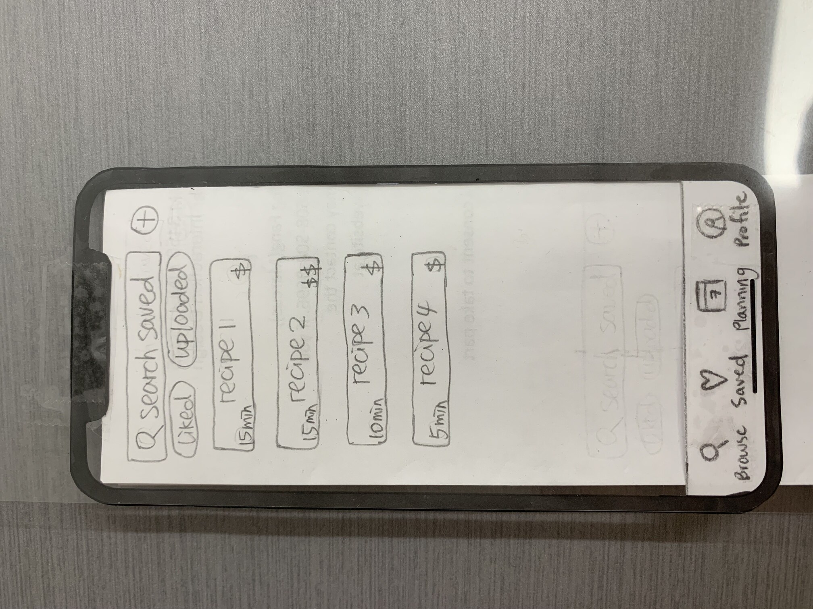
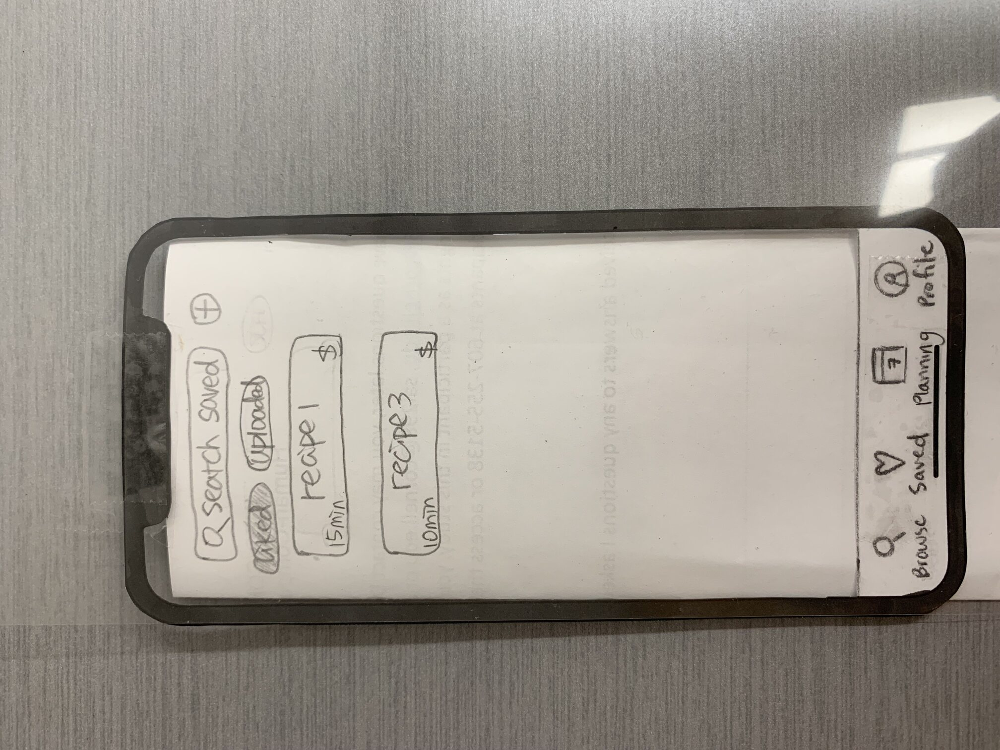
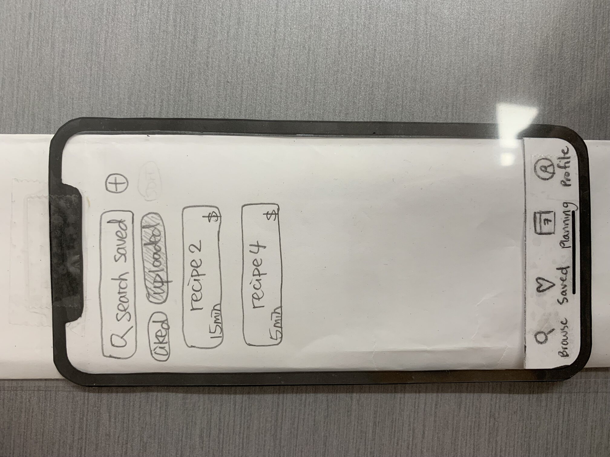
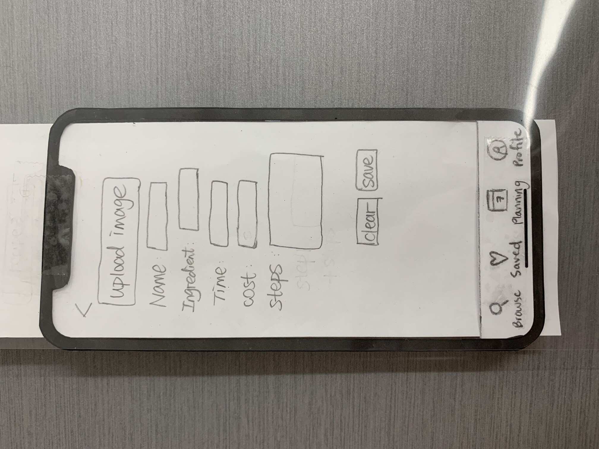
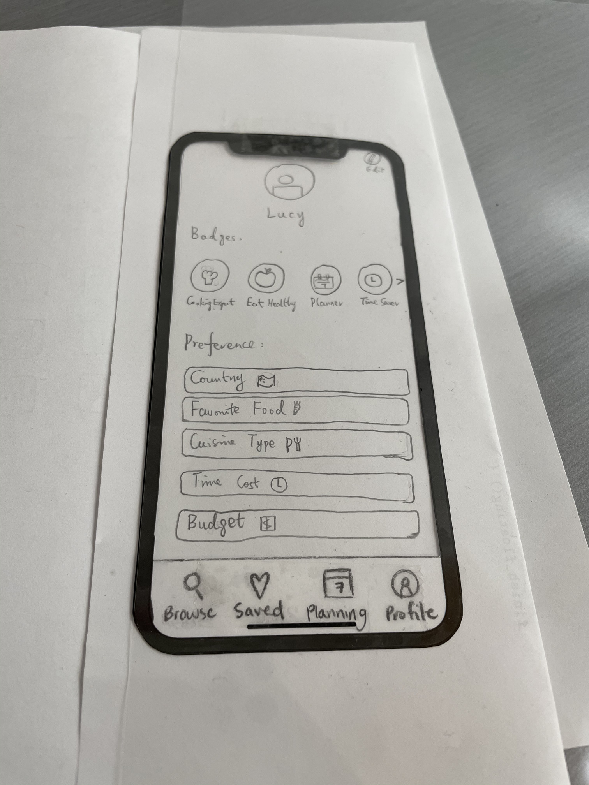
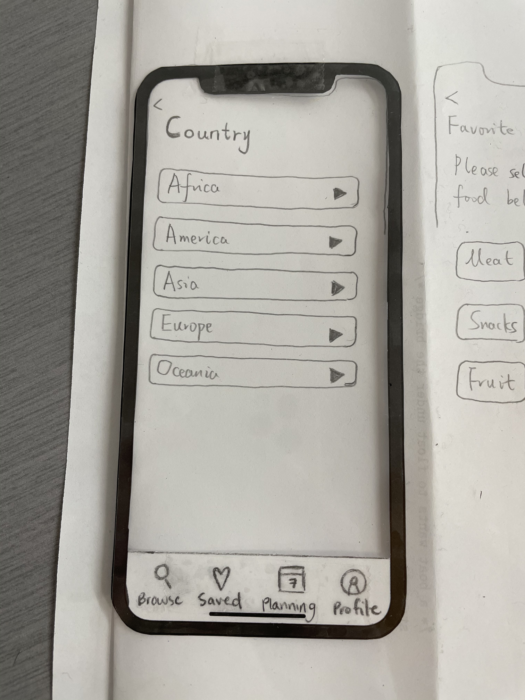
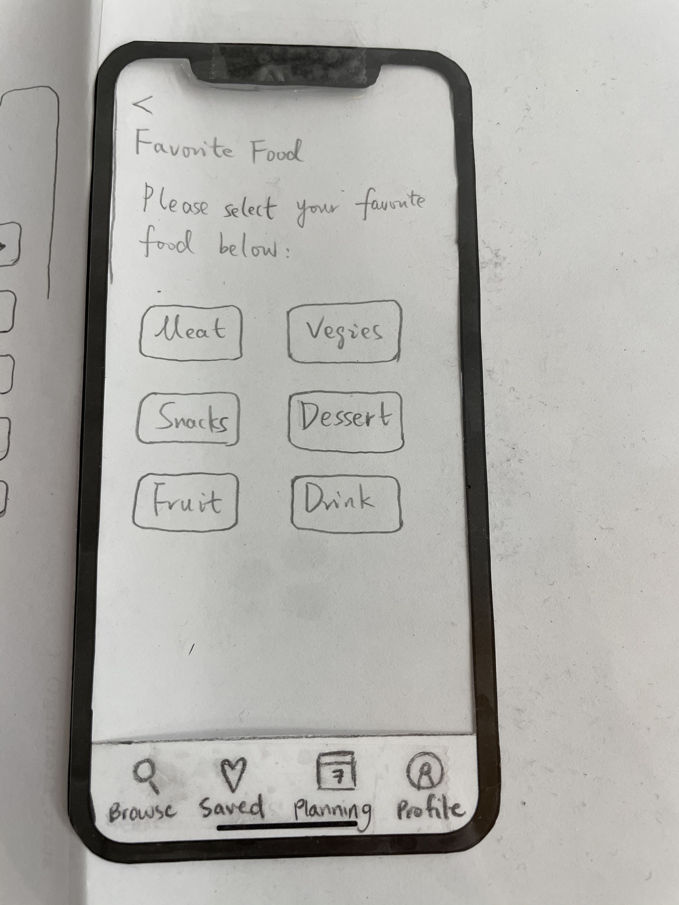
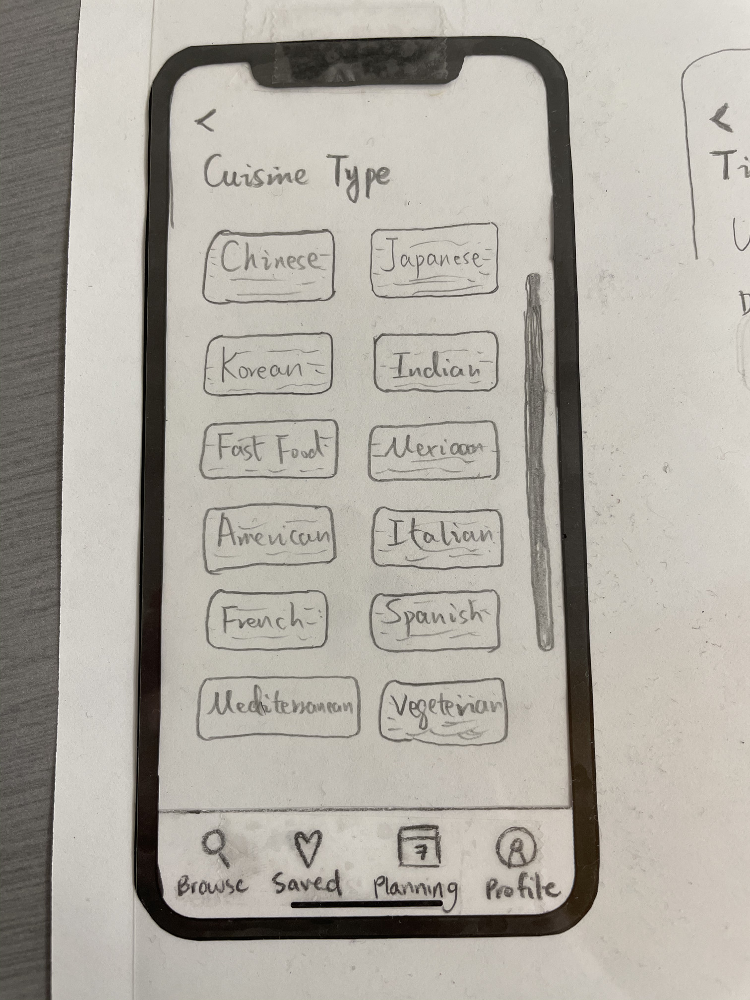
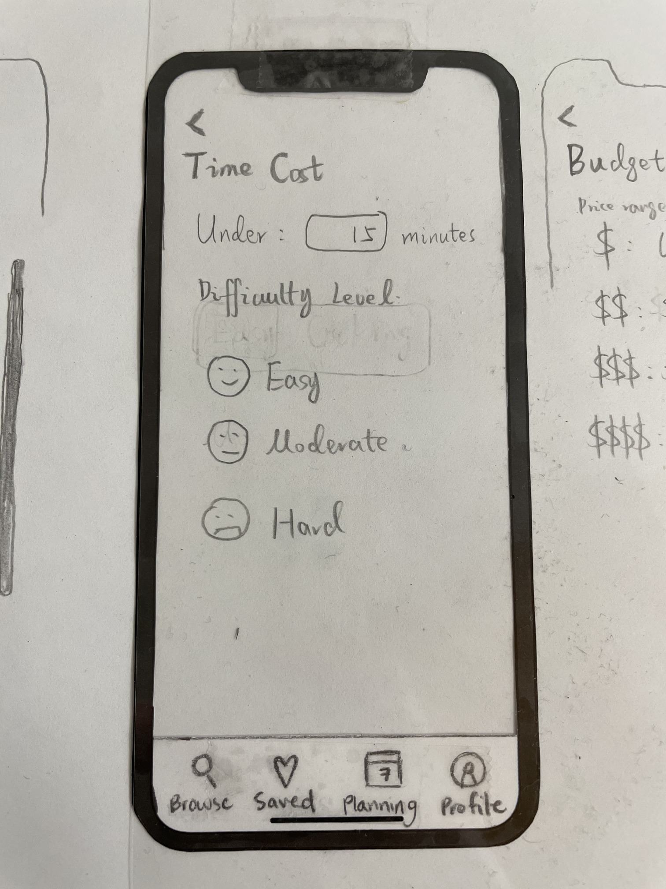
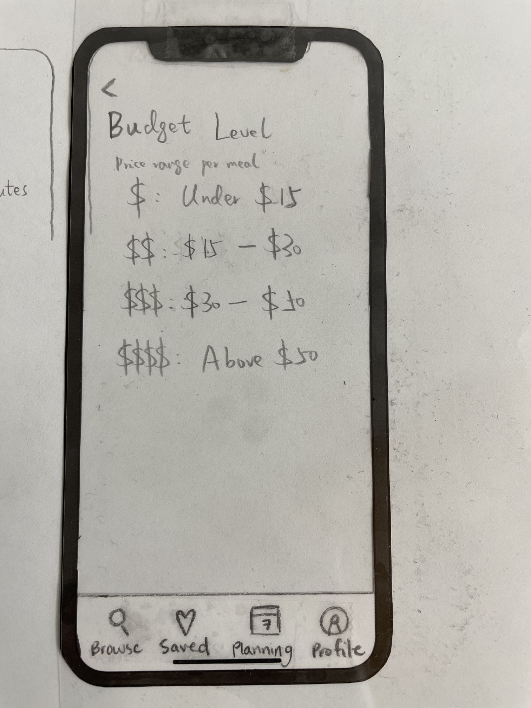

# Paper Prototype

Below we have included pictures of all components of the paper prototype we constructed. Our paper prototype has four main features in the navigation bar:
- Browse
- Saved / Favorites
- Planning
- Profile

We go more in-depth regarding the specific purposes of eac feature below. 

## 1. Browse

- Browse: Users can browse for recipes that they wish to cook.
    - They can choose to filter their recipes based on time, budget, or cuisine type. 
    - When users click on a recipe image, it will take them to a specific recipe card, where they can read additional details including the time required, cookware, ingredients, and recipe. 

Title: "Browse" landing page 

Title: "Browse" filter page 

Title: "Browse" recipe card

## 2. Favorites

- "Favorite" collection recipes: To save all the recipes liked and created by the users, so users can have easy access and quick reference.
    - Filters "liked" and "uploaded" shows the liked recipes or uploaded recipes only.
    - The + button on the right up corner allows users to upload new recipes.

Title: "Favorite" collection recipes

Title: Liked recipes

Title: Uploaded recipes

Title: Upload new recipes

## 3. Planning

TODO

## 4. Profile

- User "Profile": To act as a motivator. The user profile displays badges showing the accomplishment of users. On the profile page, users can also set up their personal profile as well as preferences of recipes.
    - The pencil on the top right corner allows users to edit their profile information.
    - Users can click buttons under preference to explore options for each category.

Title: User "Profile"

Title: Select user's country

- Users can expand each continent category and select their countries.

Title: Select user's favorite food

- Users can multi-select their favorite food categories.

Title: Select user's preferred cuisine type of recipes

- Users can multi-select their preferred cuisine types.

Title: Select user's preferred time cost of recipes

- Users can set up preferred time cost as well as difficult level of recipes.

Title: Select user's preferred budget of recipes

- Users can set up preferred budget of recipes.
